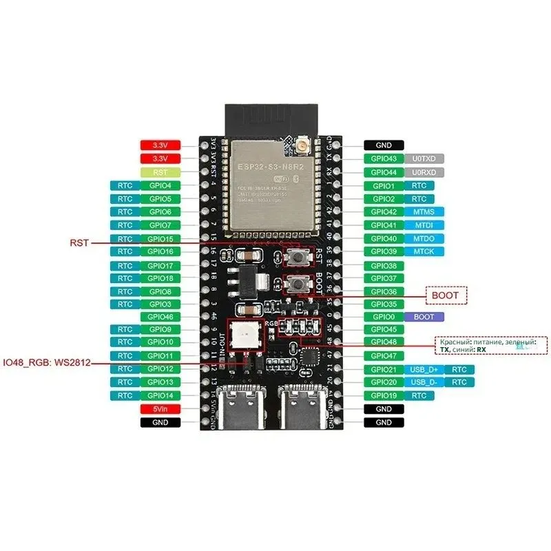
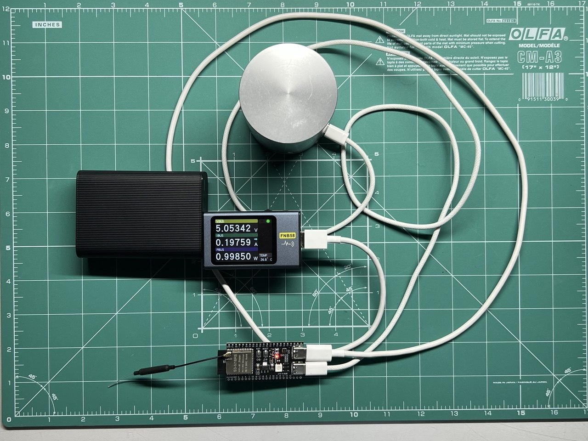
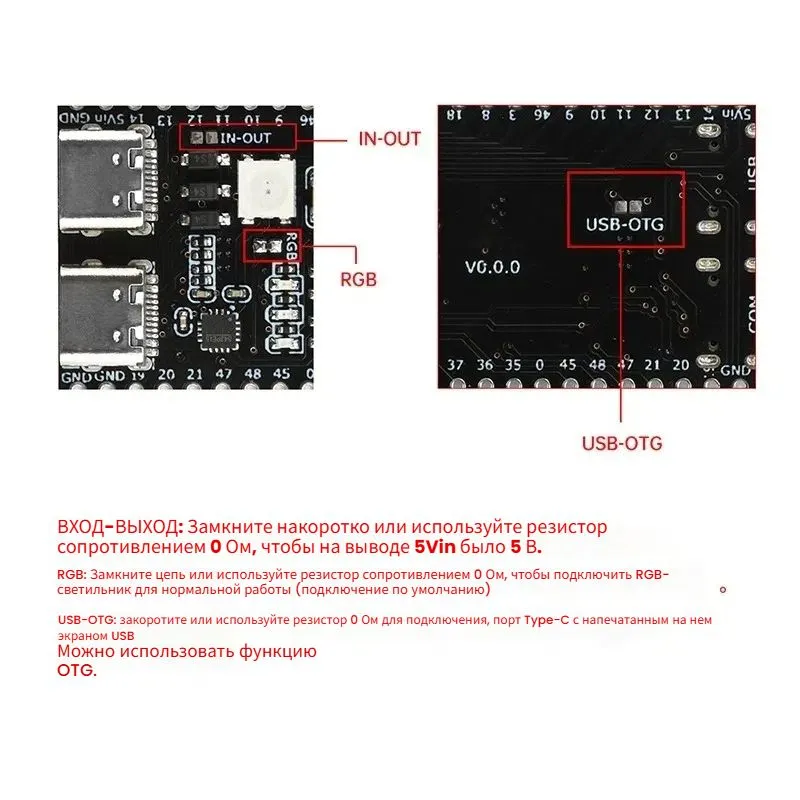
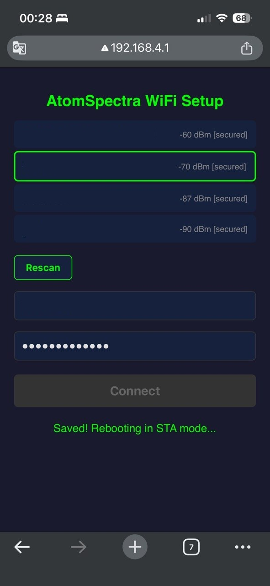

# Установка AtomSpectra ESP32 Gateway

**🇷🇺 Русская версия** · [🇬🇧 English](INSTALL.en.md)

Пошаговая инструкция: от пустой платы до работающего спектра в браузере.

## 1. Что понадобится

### Железо

| Компонент | Зачем |
|---|---|
| **ESP32-S3-DevKitC-1 N16R8** | Плата-шлюз. Именно S3 — нужен USB OTG Host (GPIO19/20). Обычный ESP32 / C3 **не подойдут** — у них нет USB Host. 16 MB Flash + 8 MB PSRAM. [Купить на Ozon](https://ozon.ru/t/BYG7CO2) |
| **USB-C OTG кабель** | Соединяет USB-порт ESP32-S3 (host) с USB-портом спектрометра (device). На ESP32-S3-DevKitC-1 **два USB-C разъёма** — нужен тот, что подписан **«USB»** (не «UART»). |
| **USB-кабель для прошивки** | Подключает UART-порт ESP32-S3 (тот, что подписан «UART») к ПК для первой прошивки. |
| **KB Radar «Atom Spectra»** | Гамма-спектрометр с USB-портом. Внутри — FTDI FT232R (VID `0403`, PID `6001`), 600000 бод. |
| **Блок питания 5V USB** | Для постоянной работы (после прошивки USB-UART кабель можно убрать). |



### Софт

**Вариант A — локальный ESP-IDF** (рекомендуется для разработки):
- [ESP-IDF v5.1+](https://docs.espressif.com/projects/esp-idf/en/stable/esp32s3/get-started/)
- Python 3.8+
- Git

**Вариант B — Docker** (проще, ничего не ставить):
- [Docker Desktop](https://www.docker.com/products/docker-desktop/)

## 2. Физическое подключение



```
                    USB-C «UART»              USB-C «USB» (OTG)
                    (для прошивки)            (для спектрометра)
                         │                         │
 ┌─────────┐        ┌────┴─────────────────────────┴────┐        ┌──────────────┐
 │   ПК    │◄──────►│         ESP32-S3-DevKitC-1        │◄──────►│ Atom Spectra │
 │ (COM14) │  USB   │            N16R8                  │  USB   │ (FTDI FT232R │
 └─────────┘        └───────────────────────────────────┘  OTG   │  600 kBd)    │
                                    │                            └──────────────┘
                                    │ WiFi 2.4 GHz
                                    ▼
                              ┌───────────┐
                              │  Браузер  │
                              │  BecqMoni │
                              └───────────┘
```

> **Важно**: на ESP32-S3-DevKitC-1 **два** USB-C разъёма. Для прошивки используется **UART**-порт.
> Для подключения спектрометра — **USB** (OTG) порт. Не перепутайте!



## 3. Сборка прошивки

### Вариант A: локальный ESP-IDF

```bash
# Клонировать репозиторий
git clone https://github.com/VibeEngineering-LLC/atomspectra-esp32.git
cd atomspectra-esp32

# Задать целевой чип
idf.py set-target esp32s3

# Собрать
idf.py build
```

Зависимости (`usb_host_cdc_acm`, `littlefs`) скачаются автоматически при первой сборке
через ESP-IDF Component Manager (`main/idf_component.yml`).

### Вариант B: Docker (без установки ESP-IDF)

```bash
git clone https://github.com/VibeEngineering-LLC/atomspectra-esp32.git
cd atomspectra-esp32

# Собрать в Docker-контейнере
docker run --rm -v "$(pwd):/project" -w /project espressif/idf:v5.4 \
  bash -c ". /opt/esp/idf/export.sh && idf.py build"
```

На Windows (PowerShell):
```powershell
docker run --rm -v "${PWD}:/project" -w /project espressif/idf:v5.4 `
  bash -c ". /opt/esp/idf/export.sh && idf.py build"
```

Результат сборки: `build/atomspectra.bin` (+ bootloader + partition table).

## 4. Прошивка

### Через ESP-IDF (если установлен)

```bash
# Подключить ESP32-S3 UART-портом к ПК
# Определить COM-порт (Device Manager → CH340/CH343/CP2102/FTDI)
idf.py -p COM14 flash
```

### Через esptool напрямую (после Docker-сборки)

```bash
pip install esptool

# Прошить все три образа
esptool.py -p COM14 -b 460800 \
  --before default_reset --after hard_reset \
  write_flash --flash_mode dio --flash_size 16MB \
  0x0 build/bootloader/bootloader.bin \
  0x8000 build/partition_table/partition-table.bin \
  0x10000 build/atomspectra.bin
```

### Первая загрузка — настройка WiFi

1. После прошивки плата перезагружается и поднимает точку доступа **«AtomSpectra-Setup»** (открытая, без пароля)
2. Подключитесь к ней телефоном или ноутбуком
3. Откроется captive portal (или перейдите на `http://192.168.4.1/`)
4. Выберите свою WiFi-сеть из списка
5. Введите пароль, нажмите **Connect**
6. Плата перезагрузится и подключится к вашей сети
7. IP-адрес платы — в таблице DHCP роутера или в UART-мониторе: `idf.py -p COM14 monitor`



## 5. Использование

1. Откройте `http://<IP-платы>/` в браузере
2. Подключите спектрометр USB-C OTG кабелем к **USB-порту** ESP32-S3 (не UART!)
3. Спектр появится автоматически (обновление раз в секунду)

### Управление

| Кнопка | Что делает |
|---|---|
| **▶ Старт** | Запуск набора спектра на приборе (команда `-sta`) |
| **■ Стоп** | Остановка набора (команда `-sto`) |
| **↻ Сброс** | Сброс накопленного спектра (команда `-rst`) |
| **Log / Lin** | Переключение логарифмической / линейной шкалы Y |
| **CPS / Counts** | Переключение единиц Y: скорость счёта / накопленные импульсы |
| **Ch / keV** | Переключение шкалы X: каналы / энергия в кэВ |
| **Сохранить** | Сохранить текущий спектр на flash ESP |
| **Загрузить** | Загрузить сохранённый спектр (overlay поверх живого) |
| **XML** | Скачать BecqMoni-совместимый файл |
| **CSV** | Скачать InterSpec-совместимый файл |

### Курсор

Наведите мышь на график — под ним появится информация:
- **Ch** — номер канала (0–8191)
- **keV** — энергия (если есть калибровка)
- **Counts** — накопленные импульсы в канале
- **CPS** — скорость счёта в канале

### Энергетическая калибровка

Калибровка автоматически считывается с прибора при подключении (команда `-inf`).
Если калибровка получена — кнопка **keV** активирует энергетическую шкалу.
Полином: `E(ch) = c₀ + c₁·ch + c₂·ch² + c₃·ch³ + c₄·ch⁴`.

## 6. Смена WiFi

Два способа:

1. **Через Web UI**: кнопка **WiFi Reset** → плата перезагружается в режим точки доступа
2. **Через UART**: `idf.py -p COM14 erase-otadata` + перепрошить

## 7. TCP-мост для BecqMoni / AtomSpectra на ПК

Если хотите использовать настольное ПО **BecqMoni** или **AtomSpectra** через WiFi:

1. В программе выберите «TCP/IP» вместо COM-порта
2. Введите адрес: `<IP-платы>` порт `8234`
3. Программа будет работать как с прямым USB-подключением

> TCP-мост и Web UI работают **одновременно** — данные дублируются.

## 8. Таблица разделов

```
nvs,      data, nvs,      0x9000,   0x6000      (24 KB — WiFi настройки)
phy_init, data, phy,      0xf000,   0x1000      (4 KB)
factory,  app,  factory,  0x10000,  3M          (3 MB — прошивка)
storage,  data, littlefs, ,         12944K      (12.9 MB — сохранённые спектры)
```

- **3 MB** под прошивку (текущий размер ~800 KB — запас большой)
- **12.9 MB** LittleFS — ~400 спектров по 32 KB каждый

## Устранение проблем

### Спектрометр не определяется по USB

- Проверьте, что кабель **дата-кабель**, а не зарядный (charge-only)
- Убедитесь, что используете **USB-порт** ESP32-S3 (подписан «USB»), а не UART
- В UART-мониторе должно быть `USB device enumerated: VID=0403 PID=6001`
- Если VID/PID другие — это не FTDI FT232R, проверьте модель спектрометра

### Нет спектра (Web UI показывает пустой график)

- Отправьте команду `-inf` через поле ввода в Web UI
- В UART-мониторе ищите строки `shproto` и `Text(...)` — признак обмена данными
- Проверьте бод: прибор работает на 600000 (не 115200!)

### WiFi не подключается

- ESP32 поддерживает **только 2.4 GHz** (не 5 GHz)
- Проверьте пароль через captive portal
- Кнопка **WiFi Reset** в Web UI сбрасывает настройки

### Сборка не проходит

- ESP-IDF **v5.1 или выше** (USB Host доступен с 5.0, LittleFS с 5.1)
- Цель **esp32s3** (не esp32, не esp32c3): `idf.py set-target esp32s3`
- При ошибках зависимостей: удалите `build/` и `managed_components/`, пересоберите