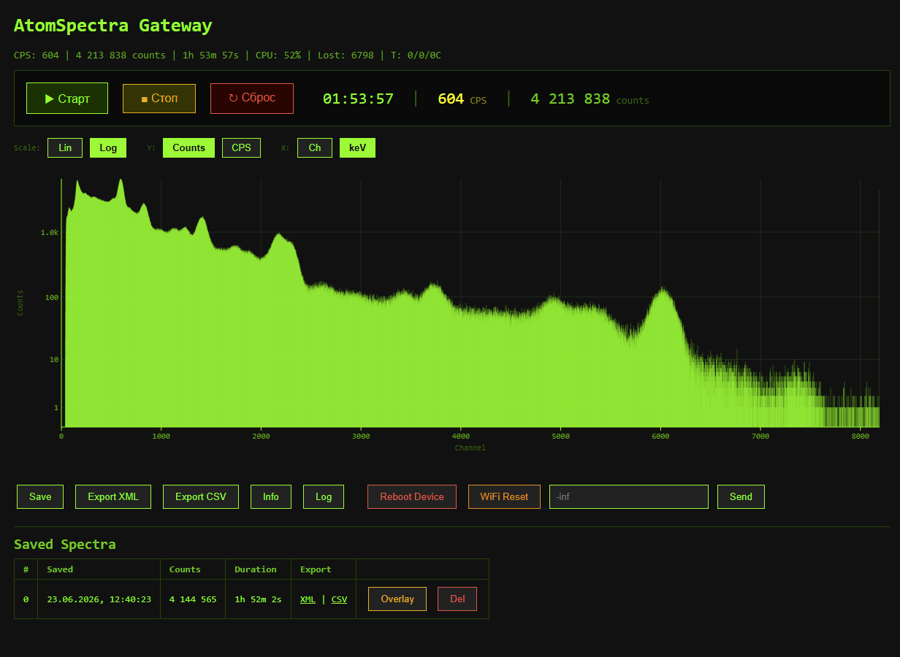
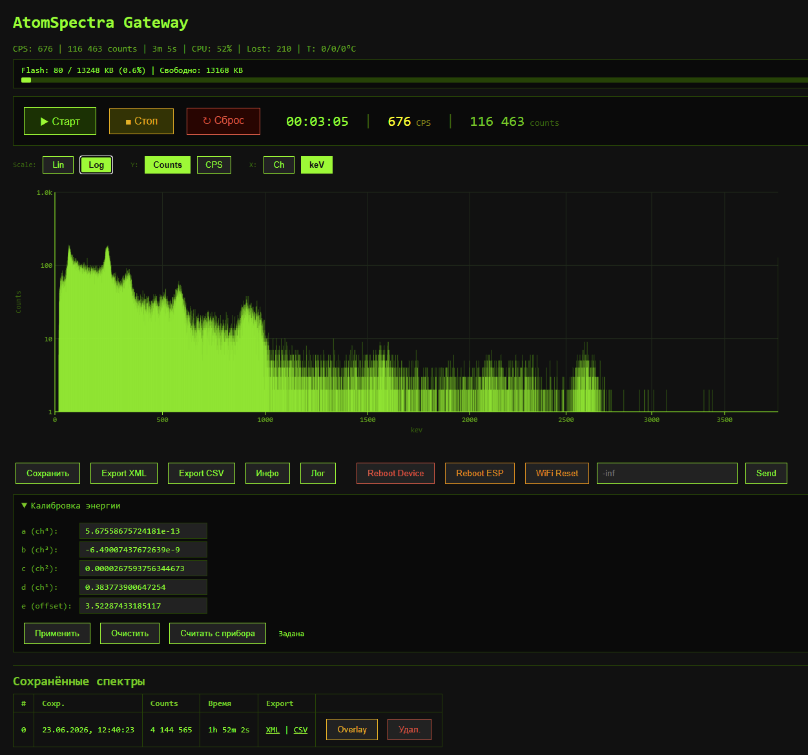

# AtomSpectra → ESP32-S3 → Web UI

**🇷🇺 Русская версия** · [🇬🇧 English](README.en.md)

WiFi-шлюз для гамма-спектрометра **KB Radar «Atom Spectra»** на ESP32-S3 с USB OTG Host.

Подключается к спектрометру по **USB** (не BLE!), принимает 8192-канальный спектр
в реальном времени и показывает его в браузере — с осями, логарифмической шкалой,
энергетической калибровкой в keV и экспортом в форматы **BecqMoni** и **InterSpec**.

   

## Что это решает

Программа **AtomSpectra** для ПК — отличная, но требует прямого USB-подключения
спектрометра к компьютеру. Этот шлюз превращает ESP32-S3 в **WiFi-мост**:

- спектрометр подключён к ESP через USB — маленькая плата рядом с прибором;
- спектр доступен **в любом браузере** по WiFi — без проводов к ПК;
- **BecqMoni XML** скачивается одним кликом — открывается в [BecqMoni](https://github.com/Am6er/BecqMoni) напрямую;
- **InterSpec CSV** — для [InterSpec](https://sandialabs.github.io/InterSpec/) от Sandia;
- **TCP-мост** (порт 8234) — BecqMoni / AtomSpectra на ПК могут подключиться через WiFi вместо COM-порта;
- спектры **сохраняются на flash** (до ~400 штук) — можно копить и экспортировать позже.

Никаких облаков. Никаких аккаунтов. Всё работает в локальной сети.

## Архитектура

```
                          USB-C OTG cable
┌──────────────────┐    (host → device)    ┌──────────────────┐
│  KB Radar        │ ◄──────────────────── │  ESP32-S3        │
│  Atom Spectra    │   shproto @ 600 kBd   │  (USB OTG Host)  │
│  (гамма-спектро- │   8192 ch × 32 bit    │                  │
│   метр, FTDI     │   + stat + calibr.    │  WiFi 2.4 GHz    │
│   FT232R внутри) │                       │  ┌────────────┐  │
└──────────────────┘                       │  │ Web UI     │  │──► Браузер
                                           │  │ REST API   │  │──► BecqMoni (TCP:8234)
                                           │  │ LittleFS   │  │──► InterSpec (CSV)
                                           │  │ 12.9 MB    │  │
                                           │  └────────────┘  │
                                           └──────────────────┘
```

## Что видно в Web UI





Web UI открывается в браузере по адресу `http://<IP-платы>/`:

**Спектр (canvas 1200×400)**
- Живой 8192-канальный спектр, обновляется раз в секунду
- **Оси** с сеткой, подписями тиков и рамкой
- **Log / Lin** — переключение логарифмической/линейной шкалы Y
- **CPS / Counts** — мгновенная скорость счёта или накопленные импульсы
- **Ch / keV** — каналы или энергия (требует калибровку от прибора)
- **Курсор** — наведи мышь на спектр → канал, энергия, счёт, CPS

**Управление прибором**
- ▶ Старт / ■ Стоп / ↻ Сброс — запуск/остановка/сброс набора на приборе
- Произвольная текстовая команда (`-inf`, `-nos 5`, etc.)
- Перезагрузка прибора (CMD 0xF3) и сброс WiFi

**Большой дисплей**
- Время набора (часы:минуты:секунды)
- CPS (импульсов в секунду)
- Общий счёт (total counts)

**Спектры**
- **Сохранить** текущий спектр на flash
- **Загрузить** сохранённый — накладывается поверх живого для сравнения (overlay)
- **Экспорт XML** — скачать BecqMoni-совместимый файл
- **Экспорт CSV** — скачать InterSpec-совместимый файл
- Удаление сохранённых спектров

## Экспорт

### BecqMoni XML (`/api/export.xml`)

Полный 8192-канальный спектр в формате `ResultDataFile` (FormatVersion 120920):
- `EnergyCalibration` — полиномиальные коэффициенты из прибора
- `ValidPulseCount` / `TotalPulseCount` / `MeasurementTime` / `LiveTime`
- 8192 `<DataPoint>` элементов
- Совместим с BecqMoni: File → Open → выбрать скачанный `.xml`

### InterSpec CSV (`/api/export.csv`)

Заголовки с калибровочными коэффициентами, серийным номером, временем:
- `calibcoeff` — полином калибровки
- `livetime` / `realtime` — время с учётом загрузки CPU
- 8192 строк `channel, count` (1-based)
- Совместим с InterSpec: File → Open → выбрать `.csv`

## Что нужно

**Железо:**
- **ESP32-S3-DevKitC-1 N16R8** (16 MB Flash, 8 MB PSRAM) — нужен именно S3 с USB OTG ([купить на Ozon](https://ozon.ru/t/BYG7CO2))
- **USB-C OTG кабель** — от ESP32-S3 (host) к спектрометру (device)
- Спектрометр **KB Radar «Atom Spectra»** (с USB-портом, внутри FTDI FT232R)
- USB-кабель для прошивки ESP (через UART-порт, не OTG)

**Софт:**
- [ESP-IDF](https://docs.espressif.com/projects/esp-idf/en/stable/esp32s3/get-started/) **v5.4** (протестированная версия; собирается в CI) **или** Docker (`espressif/idf:v5.4`)
- Драйвер CH343 (если на плате CH343 USB-UART: [WCH driver](https://www.wch-ic.com/downloads/CH343SER_ZIP.html))

> Подробная установка с нуля — в [`INSTALL.md`](INSTALL.md).
> Известные проблемы и ограничения — в [`KNOWN_ISSUES.md`](KNOWN_ISSUES.md).

## Быстрый старт (5 минут)

```bash
# 1. Клонировать
git clone https://github.com/VibeEngineering-LLC/atomspectra-esp32.git
cd atomspectra-esp32

# 2. Собрать (вариант A: локальный ESP-IDF)
idf.py set-target esp32s3
idf.py build

# 2. Собрать (вариант B: Docker, без установки ESP-IDF)
docker run --rm -v "$(pwd):/project" -w /project espressif/idf:v5.4 \
  bash -c ". /opt/esp/idf/export.sh && idf.py build"

# 3. Прошить (COM-порт подставить свой)
idf.py -p COM14 flash

# 4. Подключиться к WiFi
#    Плата поднимает AP «AtomSpectra-Setup» → captive portal → ввести SSID и пароль

# 5. Открыть в браузере
#    http://<IP-платы>/

# 6. Подключить спектрометр USB-C OTG кабелем к USB-порту ESP32-S3
#    Спектр появится автоматически
```

## Web API

| Эндпоинт | Метод | Что делает |
|---|---|---|
| `/` | GET | Web UI |
| `/api/csrf-token` | GET | Выдать CSRF-токен (нужен в заголовке `X-CSRF-Token` на всех POST) |
| `/api/status` | GET | Статус устройства (JSON) |
| `/api/spectrum.json` | GET | Живой спектр + статистика + калибровка |
| `/api/spectrum` | GET | Сырой бинарный спектр (32768 байт) |
| `/api/export.xml` | GET | BecqMoni XML (живой спектр) |
| `/api/export.csv` | GET | InterSpec CSV (живой спектр) |
| `/api/command` | POST | Послать текстовую команду прибору |
| `/api/reset` | POST | Сбросить счётчики спектра |
| `/api/save` | POST | Сохранить спектр на flash |
| `/api/list` | GET | Список сохранённых спектров (JSON) |
| `/api/saved/<N>/export.xml` | GET | Экспорт сохранённого спектра (XML) |
| `/api/saved/<N>/export.csv` | GET | Экспорт сохранённого спектра (CSV) |
| `/api/saved/<N>/spectrum.json` | GET | Сохранённый спектр (JSON) |
| `/api/saved/<N>/delete` | POST | Удалить сохранённый спектр |
| `/api/device` | GET | Информация о приборе (настройки, калибровка, серийник) |
| `/api/system` | GET | Здоровье ESP32 (heap, uptime, RSSI, flash) |
| `/api/calibration` | POST | Задать калибровочные коэффициенты вручную |
| `/api/reboot-device` | POST | Перезагрузить спектрометр (CMD 0xF3) |
| `/api/reboot-esp` | POST | Перезагрузить ESP32 |
| `/api/wifi/reset` | POST | Сбросить WiFi, перезагрузиться в режим настройки |
| `/waterfall` · `/api/waterfall/*` · `/ws/waterfall` | GET/POST/WS | **Водопад** (спектрограмма): запись, снимок, стрим — см. [`WATERFALL.md`](WATERFALL.md) |

> **Все POST-эндпоинты требуют заголовок `X-CSRF-Token`** со значением, полученным
> из `GET /api/csrf-token`. Web UI делает это автоматически. CSRF-токен генерируется
> при старте платы и защищает от подделки запросов сторонней страницей в браузере.

## Безопасность и модель доверия

Шлюз рассчитан на **доверенную локальную сеть** (домашний Wi-Fi) и **не имеет
аутентификации пользователя** — кто угодно в той же сети может открыть Web UI,
читать спектр и управлять прибором. Это осознанный выбор для домашнего прибора
без облака и аккаунтов; не выставляйте плату напрямую в интернет.

Что всё-таки защищено:
- **CSRF-токен** на всех мутирующих POST (`/api/command`, `/api/reset`, `/api/save`,
  `/api/reboot-*`, `/api/wifi/reset`, `/api/calibration`, удаление спектров). Сторонняя
  вкладка в браузере оператора не может прочитать токен (same-origin policy), поэтому
  не может «вслепую» отправить, например, сброс Wi-Fi или перезагрузку.
- **TCP-мост** (порт 8234) — один клиент одновременно.

Чего нет (by design): TLS, логин/пароль, разграничение прав. Если нужен внешний
доступ — заводите его через доверенный канал (VPN/реверс-прокси с авторизацией),
а не пробросом порта.

## TCP-мост (порт 8234)

Прозрачный serial-over-WiFi мост. BecqMoni или AtomSpectra на ПК подключаются
к `<IP-платы>:8234` вместо COM-порта — и работают как обычно.

- Один клиент одновременно
- Web UI работает параллельно с TCP-мостом
- `TCP_NODELAY` для минимальной задержки

## Водопад (спектрограмма)

Помимо живого спектра шлюз умеет копить **водопад** — последовательность спектров
через равные интервалы (каждая строка = дельта накопления за период, 8192 канала,
`uint16`). Водопад можно смотреть в браузере (`http://<IP-платы>/waterfall`),
**стримить на ПК** по WebSocket в реальном времени и **выгрузить кнопкой
«⬇ Экспорт .n42»** прямо из Web UI в индустриальный **ANSI N42.42**
(InterSpec / PeakEasy / Cambio). Интервал между строками — 5…60 с.

В `scripts/` — инструменты для ПК: экспорт в N42 (`waterfall_n42.py`), офлайн
2D-просмотрщик водопада (`waterfall_viewer.html`), захват в `.aswf`
(`waterfall_client.py`).

📖 Форматы (ASWW / ASWF / N42), полный Web API водопада, калибровка и работа со
скриптами — [`WATERFALL.md`](WATERFALL.md).

## Протокол

Atom Spectra общается по бинарному протоколу **shproto** через USB serial (600000 бод):

| Параметр | Значение |
|---|---|
| Стартовый байт | `0xFE` |
| Escape-байт | `0xFD` (следующий байт = `~byte & 0xFF`) |
| Финишный байт | `0xA5` |
| CRC | CRC-16 Modbus (init `0xFFFF`, poly `0xA001`) |
| Команды | `0x01` гистограмма, `0x03` текст, `0x04` статистика, `0xF3` reboot |

**Калибровка**: прибор возвращает 5 коэффициентов полинома в ответ на команду `-inf`
(10 строк hex-encoded doubles + CRC32). Полином: `E(ch) = c₀ + c₁·ch + c₂·ch² + c₃·ch³ + c₄·ch⁴`.

📖 Полный справочник всех команд прибора и формата пакетов — [`PROTOCOL.md`](PROTOCOL.md).

## Структура проекта

```
atomspectra-esp32/
├── components/shproto/       протокол shproto (CRC-16 Modbus, escaping)
│   ├── shproto.c
│   └── include/shproto.h
├── main/
│   ├── atomspectra.h          заголовок проекта, типы данных
│   ├── main.c                 точка входа, SNTP
│   ├── usb_host_cdc.c         USB Host CDC-ACM + FTDI vendor init
│   ├── wifi_manager.c         STA + AP captive portal
│   ├── web_server.c           HTTP API + BecqMoni XML + InterSpec CSV
│   ├── tcp_bridge.c           прозрачный serial-over-WiFi мост
│   ├── spectrum.c             обработка спектра + LittleFS хранилище
│   ├── spectrogram.c          водопад: кольцо PSRAM + запись во flash
│   └── web_waterfall.c        водопад: HTTP/WS API (ASWW/ASWF)
├── web/
│   ├── index.html             основной Web UI (спектр, кнопки, экспорт)
│   ├── setup.html             captive portal (настройка WiFi)
│   └── waterfall.html         Web UI водопада (heatmap)
├── scripts/                   ПК-инструменты: N42-экспорт, просмотрщик, захват
│   ├── waterfall_n42.py       водопад → ANSI N42.42
│   ├── waterfall_viewer.html  офлайн 2D-просмотрщик .n42
│   └── waterfall_client.py    захват WS-стрима в .aswf
├── partitions.csv             таблица разделов (3 MB app + 12.9 MB LittleFS)
├── sdkconfig.defaults         конфиг ESP32-S3 USB OTG
├── CMakeLists.txt
├── INSTALL.md                 подробная инструкция установки
├── KNOWN_ISSUES.md            известные проблемы и ограничения
├── LICENSE                    MIT
└── README.md                  этот файл
```

## Лицензия

MIT — см. [`LICENSE`](LICENSE).

## Кредиты

- **KB Radar** ([kbradar.org](https://kbradar.org/)) — производитель спектрометра Atom Spectra.
- **Am6er/BecqMoni** ([github](https://github.com/Am6er/BecqMoni)) — эталонная реализация UI для AtomSpectra, формат XML.
- **InterSpec** ([Sandia Labs](https://sandialabs.github.io/InterSpec/)) — анализ гамма-спектров.
- **Espressif** — ESP-IDF и USB Host стек.