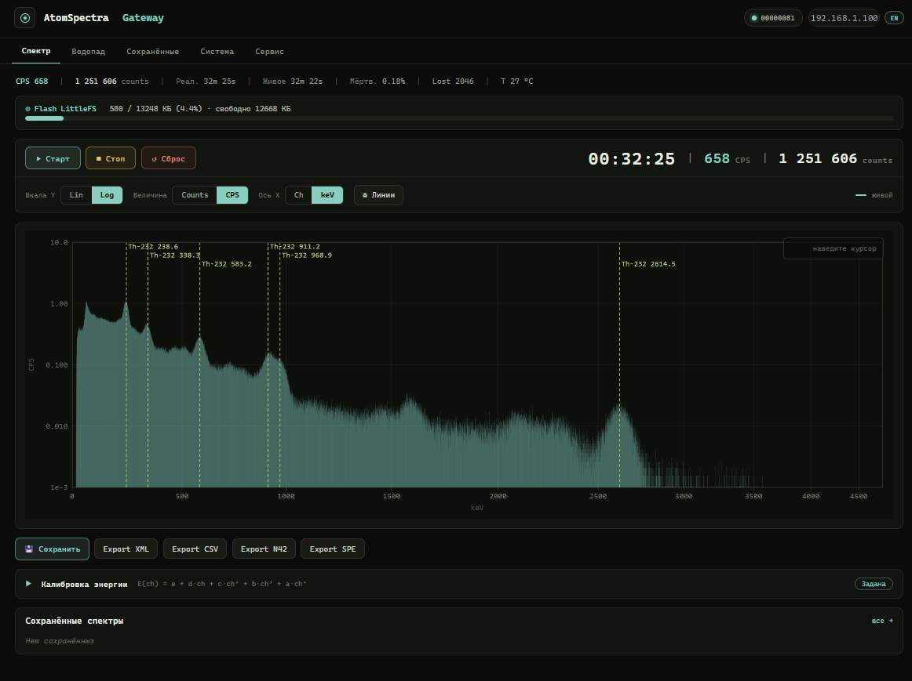
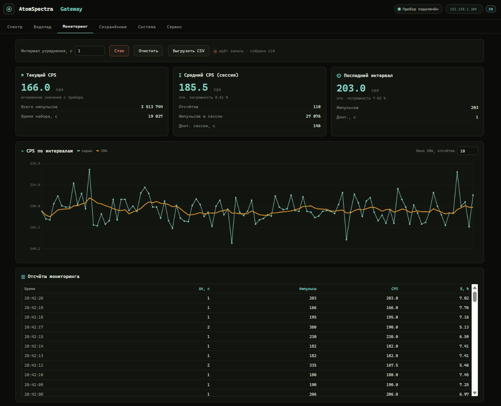
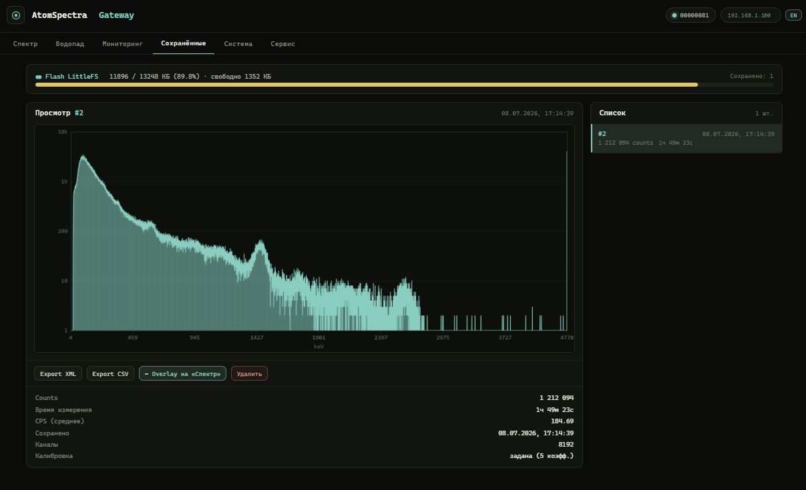
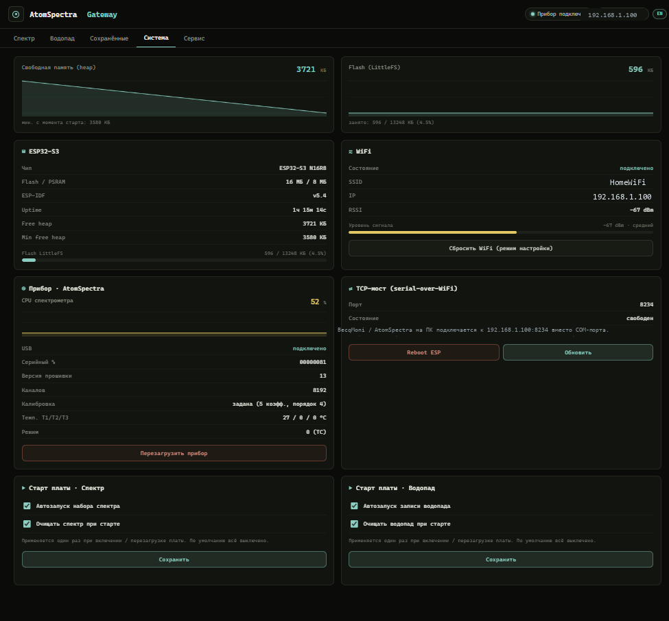
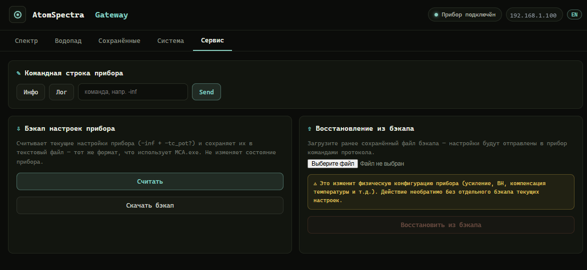

# AtomSpectra → ESP32-S3 → Web UI

**🇷🇺 Русская версия** · [🇬🇧 English](README.en.md)

WiFi-шлюз для гамма-спектрометра **KB Radar «Atom Spectra»** на ESP32-S3 с USB OTG Host.

Подключается к спектрометру по **USB** (не BLE!), принимает 8192-канальный спектр
в реальном времени и показывает его в браузере — с осями, логарифмической шкалой,
энергетической калибровкой в keV и экспортом в форматы **BecqMoni**, **InterSpec**,
**N42.42** и **ЛСРМ**.

   

## Что это решает

Программа **AtomSpectra** для ПК — отличная, но требует прямого USB-подключения
спектрометра к компьютеру. Этот шлюз превращает ESP32-S3 в **WiFi-мост**:

- спектрометр подключён к ESP через USB — маленькая плата рядом с прибором;
- спектр доступен **в любом браузере** по WiFi — без проводов к ПК;
- **BecqMoni XML** скачивается одним кликом — открывается в [BecqMoni](https://github.com/Am6er/BecqMoni) напрямую;
- **InterSpec CSV** — для [InterSpec](https://sandialabs.github.io/InterSpec/) от Sandia;
- **N42.42** (`RadInstrumentData`) и **ЛСРМ `.spe`** — индустриальный N42 и формат SpectraVibe для гамма-анализа;
- **TCP-мост** (порт 8234) — BecqMoni / AtomSpectra на ПК могут подключиться через WiFi вместо COM-порта;
- спектры **сохраняются на flash** (до ~400 штук) — можно копить и экспортировать позже.

Никаких облаков. Никаких аккаунтов. Всё работает в локальной сети.

## ⚠ Перед использованием

Шлюз подключается к спектрометру по USB и шлёт ему штатные команды управления
(`-inf`, `-sta`, `-rst`). При включённой опции «очистка спектра на старте» плата
пошлёт прибору `-rst` — **накопленный в приборе спектр будет стёрт**.

- Сохраните важные накопленные спектры штатным ПО AtomSpectra на ПК **до**
  подключения прибора к шлюзу.
- Прошивка/OTA самой платы ESP32 прибора не затрагивает, но прерывание прошивки
  может потребовать повторной заливки через USB.

## Отказ от ответственности

Прошивка предоставляется «как есть», без каких-либо гарантий. Автор не несёт
ответственности за любой прямой или косвенный ущерб: сброс накопленных данных или
настроек прибора, потерю данных, неработоспособность устройства или платы.
Используя прошивку, вы принимаете эти условия и действуете на свой страх и риск.

## Архитектура

```
                          USB-C OTG cable
┌──────────────────┐    (host → device)    ┌──────────────────┐
│  KB Radar        │ ◄──────────────────── │  ESP32-S3        │
│  Atom Spectra    │   shproto @ 600 kBd   │  (USB OTG Host)  │
│  (гамма-спектро- │   8192 ch × 32 bit    │                  │
│   метр, FTDI     │   + stat + calibr.    │  WiFi 2.4 GHz    │
│   FT232R внутри) │                       │  ┌────────────┐  │
└──────────────────┘                       │  │ Web UI     │  │──► Браузер
                                           │  │ REST API   │  │──► BecqMoni (TCP:8234)
                                           │  │ LittleFS   │  │──► InterSpec (CSV)
                                           │  │ 12.9 MB    │  │
                                           │  └────────────┘  │
                                           └──────────────────┘
```

## Что видно в Web UI



> 🔴 **Живое демо этого Web UI** (плата не нужна):
> **<https://vibeengineering-llc.github.io/atomspectra-waterfall-esp32/demo/>**

Web UI открывается в браузере по адресу `http://<IP-платы>/`:

**Спектр (canvas 1200×400)**
- Живой 8192-канальный спектр, обновляется раз в секунду
- **Оси** с сеткой, подписями тиков и рамкой
- **Log / Lin** — переключение логарифмической/линейной шкалы Y
- **CPS / Counts** — мгновенная скорость счёта или накопленные импульсы
- **Ch / keV** — каналы или энергия (требует калибровку от прибора)
- **Курсор** — наведи мышь на спектр → канал, энергия, счёт, CPS

**Управление прибором**
- ▶ Старт / ■ Стоп / ↻ Сброс — запуск/остановка/сброс набора на приборе
- Произвольная текстовая команда (`-inf`, `-nos 5`, etc.)
- Перезагрузка прибора (CMD 0xF3) и сброс WiFi

**Большой дисплей**
- Время набора (часы:минуты:секунды)
- CPS (импульсов в секунду)
- Общий счёт (total counts)

**Спектры**
- **Сохранить** текущий спектр на flash
- **Загрузить** сохранённый — накладывается поверх живого для сравнения (overlay)
- **Экспорт XML** — скачать BecqMoni-совместимый файл
- **Экспорт CSV** — скачать InterSpec-совместимый файл
- **Экспорт N42** — скачать ANSI N42.42 (`RadInstrumentData`)
- **Экспорт SPE** — скачать ЛСРМ `.spe` (формат SpectraVibe)
- Удаление сохранённых спектров

**Вкладка «Мониторинг»** — запись скорости счёта (CPS) с усреднением по заданному
интервалу: текущий CPS, средний CPS сессии со статистической погрешностью, последний
интервал, график «сырые импульсы + скользящее среднее (SMA)», таблица отсчётов и выгрузка
в CSV:



**Вкладка «Сохранённые»** — спектры, записанные на flash: список с датой, счётом и
длительностью; просмотр выбранного, наложение на живой спектр («Overlay на Спектр»),
экспорт XML/CSV и удаление:



**Вкладка «Система»** — heap/flash, WiFi (SSID, IP, RSSI), аптайм, причина последней
перезагрузки, состояние TCP-моста:



**Вкладка «Сервис»** — произвольные команды прибору, журнал обмена (devlog),
резервная копия и восстановление настроек:



## Экспорт

### BecqMoni XML (`/api/export.xml`)

Полный 8192-канальный спектр в формате `ResultDataFile` (FormatVersion 120920):
- `EnergyCalibration` — полиномиальные коэффициенты из прибора
- `ValidPulseCount` / `TotalPulseCount` / `MeasurementTime` / `LiveTime`
- 8192 `<DataPoint>` элементов
- Совместим с BecqMoni: File → Open → выбрать скачанный `.xml`

### InterSpec CSV (`/api/export.csv`)

Заголовки с калибровочными коэффициентами, серийным номером, временем:
- `calibcoeff` — полином калибровки
- `livetime` / `realtime` — реальное и живое время (с учётом мёртвого времени детектора)
- 8192 строк `channel, count` (1-based)
- Совместим с InterSpec: File → Open → выбрать `.csv`

### ANSI N42.42 (`/api/export.n42`)

Спектр в индустриальном XML-формате `RadInstrumentData` (стандарт ANSI/IEEE N42.42):
- `EnergyCalibration` с коэффициентами полинома из прибора
- `RealTimeDuration` / `LiveTimeDuration` (ISO-8601, `PT…S`)
- `ChannelData` — 8192 значения
- Импортируется в InterSpec, Cambio и другое ПО с поддержкой N42

### ЛСРМ `.spe` (`/api/export.spe`)

Спектр в текстовом формате ЛСРМ (используется в [SpectraVibe](https://github.com/Am6er)):
- секции `$SPEC_ID:` / `$MEAS_TIM:` (live realtime) / `$DATA:` / `$ENER_FIT:`
- 8192 канала по одному значению на строку
- удобно для гамма-анализа в инструментах, читающих формат ЛСРМ

## Что нужно

**Железо:**
- **ESP32-S3-DevKitC-1 N16R8** (16 MB Flash, 8 MB PSRAM) — нужен именно S3 с USB OTG ([купить на Ozon](https://ozon.ru/t/BYG7CO2))
- **USB-C OTG кабель** — от ESP32-S3 (host) к спектрометру (device)
- Спектрометр **KB Radar «Atom Spectra»** (с USB-портом, внутри FTDI FT232R)
- USB-кабель для прошивки ESP (через UART-порт, не OTG)

**Софт:**
- [ESP-IDF](https://docs.espressif.com/projects/esp-idf/en/stable/esp32s3/get-started/) **v5.4** (протестированная версия; собирается в CI) **или** Docker (`espressif/idf:v5.4`)
- Драйвер CH343 (если на плате CH343 USB-UART: [WCH driver](https://www.wch-ic.com/downloads/CH343SER_ZIP.html))

> Подробная установка с нуля — в [`INSTALL.md`](INSTALL.md).
> Известные проблемы и ограничения — в [`KNOWN_ISSUES.md`](KNOWN_ISSUES.md).

## Быстрый старт (5 минут)

```bash
# 1. Клонировать
git clone https://github.com/VibeEngineering-LLC/atomspectra-waterfall-esp32.git
cd atomspectra-waterfall-esp32

# 2. Собрать (вариант A: локальный ESP-IDF)
idf.py set-target esp32s3
idf.py build

# 2. Собрать (вариант B: Docker, без установки ESP-IDF)
docker run --rm -v "$(pwd):/project" -w /project espressif/idf:v5.4 \
  bash -c ". /opt/esp/idf/export.sh && idf.py build"

# 3. Прошить (COM-порт подставить свой)
idf.py -p COM14 flash

# 4. Подключиться к WiFi
#    Плата поднимает AP «AtomSpectra-Setup» → captive portal → ввести SSID и пароль

# 5. Открыть в браузере
#    http://<IP-платы>/

# 6. Подключить спектрометр USB-C OTG кабелем к USB-порту ESP32-S3
#    Спектр появится автоматически
```

## Режимы сети: Indoor и Outdoor

Плата работает в двух режимах. Переключатель **Indoor / Outdoor** виден сразу в шапке
стартовой страницы.

**🏠 Indoor (STA)** — как описано выше: плата — клиент домашней WiFi-сети, спектр
доступен по `http://<IP-платы>/`, время берётся по SNTP из интернета, сегменты
водопада автоматически выгружаются приёмнику.

**🌲 Outdoor (полевой AP)** — плата **сама становится точкой доступа Wi-Fi**, роутер и
интернет не нужны. Это режим для измерений в поле, когда с собой только телефон (и, по
желанию, повербанк для питания платы):

- **SSID** `AtomSpectra-Outdoor`, **пароль** `atomspectra` (WPA2-PSK), **адрес** `192.168.4.1`;
- телефон подключается к этой сети — и получает **полный** Web UI платы: живой спектр,
  водопад, экспорт (N42/XML/SPE/CSV), управление прибором (`-sta`/`-sto`/`-rst`),
  калибровка, сохранение спектров;
- данные водопада всё это время копятся на flash самой платы (раздел LittleFS) —
  забираются потом дома, в режиме Indoor, приёмником;
- всё работает офлайн: ни SNTP, ни выгрузки наружу, ни облака.

**Что происходит при подключении (captive-landing).**
Как только телефон присоединяется к `AtomSpectra-Outdoor`, операционная система делает
свою обычную «проверку связи» (Android — `generate_204`, iOS/macOS — `hotspot-detect`,
Windows — `ncsi`). Плата отвечает на неё **лёгкой страницей входа**, и телефон показывает
привычное уведомление **«Вход в сеть»** (как в кафе или аэропорту). На этой странице
**крупно выведен адрес прибора** — `192.168.4.1` и `atomspectra.local` — и она **сама, за
~1 секунду, открывает страницу прибора**; там же кнопка «Открыть прибор →».

- Страница входа **нарочно лёгкая** (без внешних шрифтов и скриптов), чтобы гарантированно
  отрисоваться в упрощённом «captive-браузере» телефона, где тяжёлый основной интерфейс
  иногда не догружается.
- Если авто-переход не сработал (встроенный браузер iOS умеет ограничивать переходы) —
  **адрес остаётся на экране**: откройте Safari/Chrome и введите `192.168.4.1` вручную.

**Как войти в Outdoor:**

1. **Переключателем** Indoor → Outdoor в шапке стартовой страницы. Плата перезагрузится и
   поднимет точку доступа; это **«липкий»** режим — сохраняется между перезагрузками, пока
   не переключите обратно;
2. **Автоматически (fallback)** — если домашняя сеть недоступна ≥ 90 с, плата сама поднимает
   полевой AP **одноразово**: следующая перезагрузка снова пробует домашнюю сеть. Удобно,
   когда унесли плату из зоны роутера, не трогая настройки;
3. **С новой (ненастроенной) платы** — в setup-портале кнопка **«Полевой режим (Outdoor)»**.

Возврат в Indoor — тем же переключателем в шапке (а для fallback-режима достаточно
перезагрузки в зоне домашней сети).

**Полевой сценарий целиком:** дома в Indoor настроили запись водопада → переключили в
Outdoor → взяли плату + телефон (+ повербанк) в поле → телефон к `AtomSpectra-Outdoor` →
всплыла страница с адресом → работаете со спектром и водопадом → дома вернули Indoor →
приёмник забрал накопленные сегменты водопада с flash платы.

### Время в полевом режиме

В Outdoor нет интернета → SNTP не работает. Время платы приходит **от браузера
телефона** автоматически при открытии любой страницы (и раз в час). Ручная коррекция —
поле `datetime-local` в разделе **Система**. При активном SNTP (дома) ручная/браузерная
установка игнорируется — источник времени не воюет сам с собой.

Экспорт (N42/XML/spe/CSV) со дня записи, когда время ещё не пришло (часы = 1970),
помечается «TIME NOT SYNCHRONIZED» и не портит нормальные записи.

### Пароль полевой точки доступа

Пароль по умолчанию `atomspectra` — **публичный, документированный**. Через открытый AP
управляется прибор (включая `-rst`, стирающий спектр) — для людных мест **смените
пароль** в разделе **Система** (поле пароля AP + подтверждение; применяется после
ребута). При дефолтном пароле Web UI показывает предупреждение.

### BT/BLE

Плата работает **только по USB** (к спектрометру) **и WiFi**. Bluetooth/BLE не
используется и **не собирается** (`CONFIG_BT_ENABLED=n`): BLE-радио ESP32-S3 не
инициализируется ни в одном режиме, RAM и питание не расходует.

## Web API

| Эндпоинт | Метод | Что делает |
|---|---|---|
| `/` | GET | Web UI |
| `/api/csrf-token` | GET | Выдать CSRF-токен (нужен в заголовке `X-CSRF-Token` на всех POST) |
| `/api/status` | GET | Статус устройства (JSON) |
| `/api/spectrum.json` | GET | Живой спектр + статистика + калибровка |
| `/api/spectrum` | GET | Сырой бинарный спектр (32768 байт) |
| `/api/export.xml` | GET | BecqMoni XML (живой спектр) |
| `/api/export.csv` | GET | InterSpec CSV (живой спектр) |
| `/api/export.n42` | GET | ANSI N42.42 (живой спектр) |
| `/api/export.spe` | GET | ЛСРМ `.spe` (живой спектр) |
| `/api/command` | POST | Послать текстовую команду прибору |
| `/api/devlog` | GET | Последние текстовые ответы прибора (кольцо, параметр `?since=N`) |
| `/api/reset` | POST | Сбросить счётчики спектра |
| `/api/save` | POST | Сохранить спектр на flash |
| `/api/list` | GET | Список сохранённых спектров (JSON) |
| `/api/saved/<N>/export.xml` | GET | Экспорт сохранённого спектра (XML) |
| `/api/saved/<N>/export.csv` | GET | Экспорт сохранённого спектра (CSV) |
| `/api/saved/<N>/spectrum.json` | GET | Сохранённый спектр (JSON) |
| `/api/saved/<N>/delete` | POST | Удалить сохранённый спектр |
| `/api/device` | GET | Информация о приборе (настройки, калибровка, серийник) |
| `/api/system` | GET | Здоровье ESP32 (heap, uptime, RSSI, flash) |
| `/api/calibration` | POST | Задать калибровочные коэффициенты вручную |
| `/api/reboot-device` | POST | Перезагрузить спектрометр (CMD 0xF3) |
| `/api/reboot-esp` | POST | Перезагрузить ESP32 |
| `/api/wifi/reset` | POST | Сбросить WiFi, перезагрузиться в режим настройки |
| `/api/time` | POST | Установить время платы (авто от браузера / вручную) — полевой режим |
| `/api/net-mode` | POST | Переключить Indoor/Outdoor, перезагрузка |
| `/api/ap-pass` | POST | Сменить пароль полевого AP, перезагрузка |
| `/waterfall` · `/api/waterfall/*` · `/ws/waterfall` | GET/POST/WS | **Водопад** (спектрограмма): запись, снимок, стрим — см. [`WATERFALL.md`](WATERFALL.md) |

> **Все POST-эндпоинты требуют заголовок `X-CSRF-Token`** со значением, полученным
> из `GET /api/csrf-token`. Web UI делает это автоматически. CSRF-токен генерируется
> при старте платы и защищает от подделки запросов сторонней страницей в браузере.

## Безопасность и модель доверия

Шлюз рассчитан на **доверенную локальную сеть** (домашний Wi-Fi) и **не имеет
аутентификации пользователя** — кто угодно в той же сети может открыть Web UI,
читать спектр и управлять прибором. Это осознанный выбор для домашнего прибора
без облака и аккаунтов; не выставляйте плату напрямую в интернет.

Что всё-таки защищено:
- **CSRF-токен** на всех мутирующих POST (`/api/command`, `/api/reset`, `/api/save`,
  `/api/reboot-*`, `/api/wifi/reset`, `/api/calibration`, удаление спектров). Сторонняя
  вкладка в браузере оператора не может прочитать токен (same-origin policy), поэтому
  не может «вслепую» отправить, например, сброс Wi-Fi или перезагрузку.
- **TCP-мост** (порт 8234) — один клиент одновременно.

Чего нет (by design): TLS, логин/пароль, разграничение прав. Если нужен внешний
доступ — заводите его через доверенный канал (VPN/реверс-прокси с авторизацией),
а не пробросом порта.

**Внешние обращения:** плата выполняет SNTP-запросы к `pool.ntp.org` для синхронизации
системного времени (используется в метках времени спектров и имён файлов). Никаких других
исходящих соединений в интернет нет — спектры и данные остаются в локальной сети.

## TCP-мост (порт 8234)

Прозрачный serial-over-WiFi мост. BecqMoni или AtomSpectra на ПК подключаются
к `<IP-платы>:8234` вместо COM-порта — и работают как обычно.

- Один клиент одновременно
- Web UI работает параллельно с TCP-мостом
- `TCP_NODELAY` для минимальной задержки

## Водопад (спектрограмма)


Помимо живого спектра шлюз умеет копить **водопад** — последовательность спектров
через равные интервалы (каждая строка = дельта накопления за период, 8192 канала,
`uint16`). Запись идёт **на стороне платы**: включил «Старт» — и плата пишет
сегменты `.aswf` во flash сама, переживая закрытие вкладки, перезагрузку и сбой
питания (#REC-11-A1). Готовые сегменты можно смотреть прямо в браузере
(`http://<IP-платы>/waterfall`), **стримить на ПК в реальном времени** по
WebSocket, **забирать по HTTP** и сшивать в единый файл (`wf_pull_client.py` /
`wf_recorder_app.py`, #REC-12 — для многочасовых/многодневных записей без
постоянного соединения) или **выгрузить кнопкой «⬇ Экспорт .n42»** прямо из
Web UI в индустриальный **ANSI N42.42** (InterSpec / PeakEasy / Cambio).
Интервал между строками — **5 с…60 мин**. Цвет спектрограммы — любая из
**14 палитр** (Inferno по умолчанию; выбор сохраняется в браузере).

> 🔴 **Живое демо на реальных данных:**
> **<https://vibeengineering-llc.github.io/atomspectra-waterfall-esp32/demo/>**
> — та же спектрограмма из Web UI прошивки, отрисованная из реальной записи `.aswf`
> прибора «Atom Spectra» (480 строк × 8192 канала, реальная калибровка). Плата не нужна:
> наведите курсор — внизу появится срез спектра с энергетической шкалой в кэВ.

В `scripts/` — инструменты для ПК: экспорт в N42 (`waterfall_n42.py`), офлайн
2D-просмотрщик водопада (`waterfall_viewer.html`), захват в `.aswf`
(`waterfall_client.py`) и desktop-рекордер с автосшивкой сегментов на лету
(`wf_recorder_app.py` / `wf_pull_client.py`, #REC-12) для многочасовой/многодневной
записи без постоянного WS-соединения.

> **Готовый Windows exe рекордера (без установки Python):**
> [`wf-recorder-v0.1.0`](https://github.com/VibeEngineering-LLC/atomspectra-waterfall-esp32/releases/tag/wf-recorder-v0.1.0)
> — самодостаточный `wf_recorder.exe` (~12 МБ), двойной клик, GUI откроется.
> Проверен 11-часовым соак-тестом (60 сегментов, 660 строк, 0 потерь; отчёт
> [`docs/rec12_report.md`](docs/rec12_report.md)).


> **Продвинутый вьюер.** Для полноценного нативного приложения (3D-водопад, 2D-карта,
> панель «Срезы/Сечения/Выборки») см. отдельный репозиторий
> **[waterfall-viewer](https://github.com/VibeEngineering-LLC/waterfall-viewer)** —
> он мощнее однофайлового HTML-вьюера из `scripts/`.

📖 Форматы (ASWW / ASWF / N42), полный Web API водопада, калибровка и работа со
скриптами — [`WATERFALL.md`](WATERFALL.md).

## Протокол

Atom Spectra общается по бинарному протоколу **shproto** через USB serial (600000 бод):

| Параметр | Значение |
|---|---|
| Стартовый байт | `0xFE` |
| Escape-байт | `0xFD` (следующий байт = `~byte & 0xFF`) |
| Финишный байт | `0xA5` |
| CRC | CRC-16 Modbus (init `0xFFFF`, poly `0xA001`) |
| Команды | `0x01` гистограмма, `0x03` текст, `0x04` статистика, `0xF3` reboot |

**Калибровка**: прибор возвращает 5 коэффициентов полинома в ответ на команду `-inf`
(10 строк hex-encoded doubles + CRC32). Полином: `E(ch) = c₀ + c₁·ch + c₂·ch² + c₃·ch³ + c₄·ch⁴`.

📖 Полный справочник всех команд прибора и формата пакетов — [`PROTOCOL.md`](PROTOCOL.md).

## Структура проекта

```
atomspectra-waterfall-esp32/
├── components/shproto/       протокол shproto (CRC-16 Modbus, escaping)
│   ├── shproto.c
│   └── include/shproto.h
├── main/
│   ├── atomspectra.h          заголовок проекта, типы данных
│   ├── main.c                 точка входа, SNTP
│   ├── boot_config.c          поведение при старте платы (NVS-флаги, #FW-2/#FW-3)
│   ├── usb_host_cdc.c         USB Host CDC-ACM + FTDI vendor init
│   ├── wifi_manager.c         STA + AP captive portal
│   ├── web_server.c           HTTP API + BecqMoni XML + InterSpec CSV
│   ├── web_util.c             общие HTTP-хелперы Web-сервера
│   ├── tcp_bridge.c           прозрачный serial-over-WiFi мост
│   ├── spectrum.c             обработка спектра + LittleFS хранилище
│   ├── spectrogram.c          водопад: кольцо PSRAM + запись во flash
│   ├── web_waterfall.c        водопад: HTTP/WS API (ASWW/ASWF)
│   └── wf_offload.c           водопад: автовыгрузка сегментов по HTTP POST (#REC-11-A2)
├── web/
│   ├── index.html             основной Web UI (спектр, кнопки, экспорт)
│   ├── setup.html             captive portal (настройка WiFi)
│   └── waterfall.html         Web UI водопада (heatmap)
├── scripts/                   ПК-инструменты: N42-экспорт, просмотрщик, захват, рекордер
│   ├── waterfall_n42.py       водопад → ANSI N42.42
│   ├── waterfall_viewer.html  офлайн 2D-просмотрщик .n42/.aswf
│   ├── waterfall_client.py    захват WS-стрима в .aswf
│   ├── wf_pull_client.py      pull-запись сегментов + автосшивка в .aswf (#REC-12)
│   └── wf_recorder_app.py     desktop-GUI поверх wf_pull_client.py (+ wf_recorder.bat)
├── partitions.csv             таблица разделов (3 MB app + 12.9 MB LittleFS)
├── sdkconfig.defaults         конфиг ESP32-S3 USB OTG
├── CMakeLists.txt
├── INSTALL.md                 подробная инструкция установки
├── KNOWN_ISSUES.md            известные проблемы и ограничения
├── LICENSE                    MIT
└── README.md                  этот файл
```

## ⚠ Отказ от ответственности

**Все эксперименты со спектрометрами и подключённым оборудованием вы проводите на свой
страх и риск.** Проект предоставляется «как есть» (as is), без каких-либо гарантий.
Авторы и участники проекта **не несут ответственности** за любой вред, прямой или
косвенный: повреждение спектрометра, детектора, ФЭУ, ESP32-платы, компьютера или иного
оборудования, потерю данных или настроек прибора.

В частности:
- Команды настройки прибора (`-ris`, `-fall`, `-nos`, `-max`, `-hyst`, `-U`, `-V`,
  `-step` и др.) изменяют **внутреннюю конфигурацию обработки сигнала и аппаратные
  параметры HV/усиления** (`POT` / `POT2`). Неверные значения могут сбить заводскую
  настройку детектора или **повредить прибор**. Эти параметры индивидуальны для каждого
  экземпляра — **не записывайте их «вслепую»** и не копируйте чужие значения. См.
  [`KNOWN_ISSUES.md`](KNOWN_ISSUES.md) (BUG-AS-08).
- Высокое напряжение (HV) детектора — потенциально опасно для прибора при неверной
  настройке.
- Восстановление сбитой настройки детектора выполняет **производитель прибора (KB Radar)**,
  а не этот шлюз. При сбое заводского профиля детектора — обращайтесь к производителю,
  не пытайтесь восстановить параметры самостоятельно.

Используя этот проект, вы соглашаетесь, что понимаете риски и принимаете полную
ответственность за свои действия с оборудованием.

## Лицензия

MIT — см. [`LICENSE`](LICENSE).

## Кредиты

- **KB Radar** ([kbradar.org](https://kbradar.org/)) — производитель спектрометра Atom Spectra.
- **Am6er/BecqMoni** ([github](https://github.com/Am6er/BecqMoni)) — эталонная реализация UI для AtomSpectra, формат XML.
- **InterSpec** ([Sandia Labs](https://sandialabs.github.io/InterSpec/)) — анализ гамма-спектров.
- **Espressif** — ESP-IDF и USB Host стек.