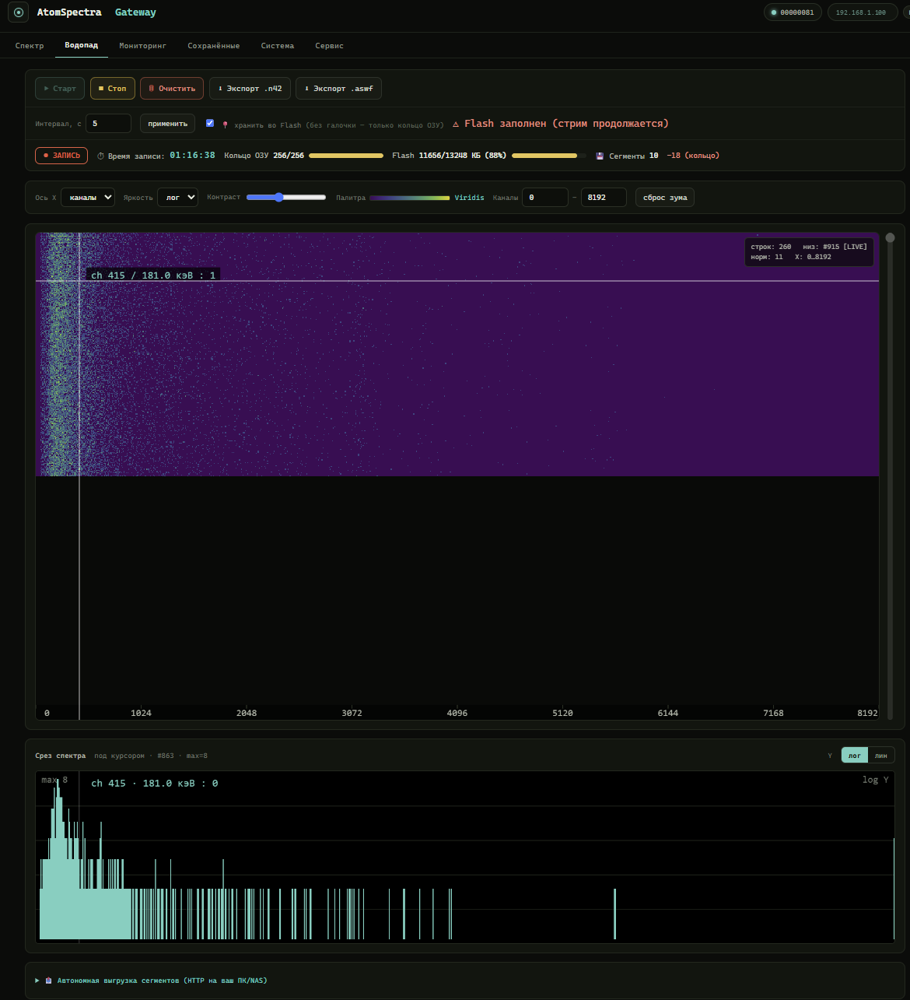

# Водопад (спектрограмма) — накопление, стрим на ПК, экспорт

[🇬🇧 English](WATERFALL.en.md) · [← README](README.md)

Шлюз умеет копить **водопад** (спектрограмму): последовательность спектров,
снятых через равные интервалы. Каждая строка водопада — это **дельта**
накопительного спектра за интервал, т.е. законченный спектр «импульсы за период»,
8192 канала, `uint16` на канал (**16 КБ на строку**).

Водопад можно:

- **писать автономно во Flash сегментами `.aswf` — без браузера** (#REC-11-A1):
  нажал «Старт», закрыл вкладку — плата продолжает писать сама и **переживает
  перезагрузку/сбой питания** (см. [«Автономная запись сегментами»](#автономная-запись-сегментами-rec-11-a1));
- смотреть прямо в браузере платы — `http://<IP-платы>/waterfall`;
- **стримить на ПК в реальном времени** по WebSocket;
- **забрать готовые сегменты `.aswf` по HTTP** (`/api/waterfall/segments` →
  `/api/waterfall/segment?name=…`) и склеить на ПК/в браузере;
- **выгрузить кнопкой «⬇ Экспорт .n42»** прямо из Web UI — на плате собирается
  **ANSI N42.42** из кольца PSRAM (работает и без записи во flash);
- конвертировать в **ANSI N42.42** скриптами из репозитория;
- открыть как 2D-водопад в офлайн-просмотрщике из этого репозитория.

> **mDNS.** Шлюз анонсирует себя как **`atomspectra.local`** (#REC-9) — везде ниже
> вместо `<IP-платы>` можно писать `http://atomspectra.local/`.

## Как выглядит

Встроенный Web UI водопада (`http://<IP-платы>/waterfall`): сверху — спектрограмма
(время идёт вниз, ось X — каналы/энергия), под ней — срез текущего спектра по
наведённой строке. Цвет — интенсивность по выбранной палитре и шкале (лог/лин).



> 🔴 **Живое демо этой вкладки на реальных данных** (плата не нужна):
> **<https://vibeengineering-llc.github.io/atomspectra-waterfall-esp32/demo/waterfall.html>**

Кнопки **Старт / Стоп / Очистить / Экспорт .n42**, поле **Интервал**, флажок
**хранить во Flash**, выбор оси X (каналы/кэВ), яркости (лог/лин), палитры,
ползунок контраста и зум по каналам. Счётчик показывает строк всего · в кольце
(`149/256`) · во Flash.

### Палитры спектрограммы

Цвет строки задаётся выбранной **палитрой** (кнопка выбора над спектрограммой).
Доступно **14** палитр; выбор сохраняется в браузере (`localStorage`, ключ
`aswf-pal`) и применяется ко всему водопаду на лету (палитра разворачивается в
256-уровневый LUT). По умолчанию — **Inferno**.

| Палитра | Тип | Заметка |
|---|---|---|
| **Inferno** | перцептивная, тёплая | по умолчанию, контрастна на тёмном фоне |
| **Magma** | перцептивная, тёплая | мягче Inferno, фиолетово-розовая |
| **Plasma** | перцептивная, тёплая | фиолет→жёлт, без чёрного |
| **Viridis** | перцептивная, холодная | дружелюбна к дальтонизму |
| **Cividis** | перцептивная, холодная | оптимизирована под дальтонизм |
| **Parula** | перцептивная | палитра MATLAB по умолчанию |
| **Cubehelix** | монотонная яркость | корректна и в ч/б печати |
| **Turbo** | радужная | замена Jet с равномерной яркостью |
| **Jet** | радужная | классика MATLAB |
| **Spectral** | дивергентная | синий↔жёлтый↔красный |
| **Hot** | термальная | чёрный→красн→жёлт→белый |
| **Ocean** | холодная | чёрный→синий→белый, спокойная |
| **Cool** | яркая | голубой→пурпурный |
| **Grayscale** | моно | для печати |

> Для количественной оценки предпочтительны перцептивно-равномерные палитры
> (Inferno/Magma/Plasma/Viridis/Cividis/Parula/Cubehelix/Turbo) — они не создают
> ложных «полос» интенсивности. Jet и прочие радужные — только для наглядности.

## Как это устроено

| Параметр | Значение | Где в коде |
|---|---|---|
| Каналов | 8192 (`WF_CHANNELS`) | `main/spectrogram.h` |
| Размер строки | 16 КБ (`WF_ROW_BYTES`) | `main/spectrogram.h` |
| Кольцо в PSRAM | 256 строк × 16 КБ = **4 МБ** (`WF_RING_ROWS_DEFAULT`) | `main/spectrogram.h` |
| Интервал по умолчанию | 5 с (`WF_INTERVAL_DEFAULT`), диапазон **5…3600** с (`WF_INTERVAL_MIN`/`WF_INTERVAL_MAX`) | `main/spectrogram.h` |
| Строк в сегменте | 64 (`WF_SEG_MAX_ROWS`) ≈ 1 МБ payload | `main/spectrogram.h` |
| Финализация сегмента не реже | 10 мин (`WF_SEG_MAX_AGE_SEC`) | `main/spectrogram.h` |
| Резерв заголовка сегмента | 4096 Б (`WF_HDR_RESERVE`), payload с offset 4104 (`WF_SEG_HEADER`) | `main/spectrogram.h` |
| Тип данных | `uint16` little-endian | `main/web_waterfall.c` |

Запись (`recording`) копит строки в **кольцевой буфер PSRAM** (последние 256 строк
всегда под рукой для окна/стрима). Если включён `persist`, строки пишутся ещё и во
**flash** (LittleFS) — но не одним файлом, а **сегментами** `.aswf` (см. ниже): это
единица отправки, единица кольца keep-last и независимый файл для склейки. Когда место
на flash кончается, включается **кольцо keep-last**: затирается самый старый ещё не
отправленный сегмент, `flash_full` становится `true` (= кольцо активно), счётчик
`seg_dropped` растёт; кольцо PSRAM и WS-стрим продолжают работать без перерыва.

> **Калибровка.** Реальная энергетическая калибровка прибора — это полином из
> 5 коэффициентов (`E(ch) = c₀ + c₁·ch + c₂·ch² + c₃·ch³ + c₄·ch⁴`). Она приходит в
> **текстовом заголовке WebSocket** (`/ws/waterfall`) и в заголовке файла `.aswf`,
> а **не** в полях `t1/t2/t3` из `/api/spectrum.json`. Инструменты в `scripts/`
> берут калибровку именно из WS-заголовка, поэтому ось получается в **кэВ**.

## Автономная запись сегментами (#REC-11-A1)

Главное свойство: **запись идёт на стороне платы и не зависит от браузера.** Браузер
нужен только чтобы нажать «Старт» (и потом «Стоп») — после старта вкладку можно
закрыть, выключить ПК, и плата продолжит писать сама.

Как только включена запись с `persist`, плата пишет водопад во Flash **сегментами**
`/storage/wf/seg_NNNNN.aswf` (монотонный индекс). Каждый сегмент — **самостоятельный
валидный `.aswf`** (свой заголовок, своя калибровка, свой `started_at`), поэтому его
можно забрать и прочитать независимо от остальных.

| Свойство | Поведение |
|---|---|
| Размер сегмента | до **64 строк** (`WF_SEG_MAX_ROWS`) ≈ 1 МБ payload |
| Финализация | по достижении 64 строк **ИЛИ** через 10 мин (`WF_SEG_MAX_AGE_SEC`) — чтобы при больших интервалах файл не висел открытым часами |
| Переживание ребута | на boot `spectrogram_restore()` сверяет `/storage/wf`: удаляет пустые огрызки, восстанавливает индекс; **если запись была активна — продолжает в НОВЫЙ сегмент** (mid-segment append не делается, каждый файл остаётся валидным) |
| Flash заполнен | **кольцо keep-last**: затирается самый старый ещё не отправленный сегмент; `flash_full=true`, растёт `seg_dropped` |
| Счётчик строк | шапка всегда несёт `saved_rows=0` — **строки выводятся из размера файла** (`payload / row_stride`); шапка никогда не патчится (патч offset в LittleFS = copy-on-write всего хвоста файла с многосекундной заморозкой flash-кэша) |
| Открытый сегмент | в `/segments` помечен `finalized:false` (по индексу открытого файла); забирать в браузер до finalize не нужно |

Ёмкость storage ≈ **763 строки** суммарно. При интервале 10 мин это ≈ **5.3 суток**
непрерывной записи, при 1-часовом интервале ≈ **31 сутки** (до включения кольца
keep-last).

> **Стабильность (#STAB-2, 2026-07-04):** 9.40-часовой прогон записи через плату — 0
> ребутов, 0 `seg_dropped`, все `SEG_ROLLOVER` чистые (см. фикс #WF-1 в
> [`KNOWN_ISSUES.md`](KNOWN_ISSUES.md)). Полный отчёт: [`docs/stab2_report.md`](docs/stab2_report.md).
>
> **⚠ #FW-19:** экспорт n42 отдаёт только последние **256 строк** (~4.25 ч при кадансе
> ~60 с) — это отдельный лимит поля `ring_capacity` (`/api/waterfall/status`), меньше
> оценки ёмкости раздела (763 строки) выше. Для записей длиннее ~4.25 ч забирать сегменты
> периодически через `/api/waterfall/segment` (см. ниже), не дожидаясь конца записи.
> Подробности: [`docs/stab2_report.md`](docs/stab2_report.md) §6, [`KNOWN_ISSUES.md`](KNOWN_ISSUES.md) (#FW-19).

> Отдача сегмента (`/api/waterfall/segment?name=…`) — **строго read-only**: плата
> файл не удаляет. Удаление — только кольцо keep-last (или будущий A2-аплоадер после
> успешной отправки). Так браузер/приёмник не может случайно стереть ещё не
> склеенные данные.

## Web API водопада

| Эндпоинт | Метод | Что делает |
|---|---|---|
| `/waterfall` | GET | Встроенный Web UI водопада (heatmap прямо на плате) |
| `/api/waterfall/status` | GET | Статус водопада (JSON, см. ниже) |
| `/api/waterfall/start` | POST | Начать запись |
| `/api/waterfall/stop` | POST | Остановить запись |
| `/api/waterfall/clear` | POST | Очистить кольцо + сегменты на flash (только когда запись остановлена) |
| `/api/waterfall/config` | POST | `{"interval":N,"persist":bool}` — интервал (с) и запись во flash |
| `/api/waterfall/window` | GET | Снимок кольца (бинарь **ASWW**, до 256 строк) |
| `/api/waterfall/segments` | GET | **Список сегментов на Flash** (JSON-массив, см. ниже). Не требует CSRF |
| `/api/waterfall/segment?name=seg_NNNNN.aswf` | GET | **Сырой файл сегмента** (`application/octet-stream`, read-only). Строгая валидация имени (anti-traversal): `seg_`+цифры+`.aswf`. `400 bad name` / `404 not found` |
| `/api/waterfall/export.n42` | GET | **Экспорт в ANSI N42.42** из кольца PSRAM (одна `<RadMeasurement>` на строку, `CountedZeroes`, калибровка в `<EnergyCalibration>`). Кнопка «⬇ Экспорт .n42» в Web UI. Не требует записи во flash |
| `/ws/waterfall` | WS | Текстовый заголовок при подключении, далее по одному бинарному кадру (16384 Б) на каждую новую строку |

> Все POST требуют заголовок **`X-CSRF-Token`** (получить из `GET /api/csrf-token`),
> как и остальной API шлюза.

`GET /api/waterfall/status` → JSON:

```json
{
  "recording": false, "persist": false, "flash_full": false, "ready": true,
  "interval_sec": 5, "ring_capacity": 256, "ring_count": 0,
  "total_rows": 0, "flash_rows": 0,
  "seg_count": 0, "seg_dropped": 0,
  "started_at": 0, "channels": 8192
}
```

- `ready` — PSRAM-кольцо выделено;
- `ring_count` — валидных строк в кольце (≤ `ring_capacity`);
- `total_rows` — строк записано с момента `start` (монотонно);
- `flash_rows` — строк во flash записано за сессию (монотонно);
- `flash_full` — **кольцо keep-last активно** (старые сегменты затираются), а не «flash кончился навсегда»;
- `seg_count` — завершённых сегментов на Flash сейчас;
- `seg_dropped` — сегментов удалено кольцом keep-last с момента boot.

`GET /api/waterfall/segments` → JSON-массив (без CSRF). Каждый элемент:

```json
[ {"name":"seg_00000.aswf","idx":0,"bytes":1052680,"rows":64,"finalized":true} ]
```

- `rows` вычисляется из размера файла: `(bytes − 4104) / 16384`;
- `finalized:false` — сегмент сейчас открыт — забирать не нужно;
- каталога ещё нет / запись не велась → `[]`.

## Форматы файлов

### ASWW — снимок окна (`/api/waterfall/window`)

Компактный бинарь без заголовка-JSON, отдаётся потоково (один 16-КБ bounce-буфер,
без второго 4-МБ буфера → нет OOM):

```
"ASWW" (4 байта)
channels     u32 LE   (= 8192)
rows         u32 LE   (строк в окне)
first_index  u32 LE   (total-индекс первой строки)
interval     u32 LE   (секунд между строками)
payload      = rows × channels × uint16 LE   (хронологически, старейшая первой)
```

### ASWF — самодостаточный файл

Бинарь с JSON-заголовком — содержит всё для автономной интерпретации. Общий каркас:

```
"ASWF" (4 байта)
header_len   u32 LE          (длина заголовка-JSON в байтах)
header       = JSON (utf-8), header_len байт
payload      = rows × запись-строки   (v1: 16384 Б; v2: row_stride Б, см. ниже)
```

`.aswf` теперь пишут **два** источника:

1. **PC-скрипт `scripts/waterfall_client.py`** из WS-стрима (`/ws/waterfall`) —
   формат **v1**: запись строки = ровно `channels × uint16 LE` (16384 Б),
   переменный `header_len`, ключ `rows`:

   ```json
   {
     "format": "atomspectra-waterfall", "version": 1,
     "channels": 8192, "dtype": "uint16", "byte_order": "little",
     "rows": 1234, "interval_sec": 5, "started_at": 1750000000,
     "serial": "...", "calibration": [c0, c1, c2, c3, c4]
   }
   ```

2. **Сама прошивка** — сегменты `/storage/wf/seg_NNNNN.aswf` (#REC-11-A1), формат
   **v2**: после 16384 Б спектра каждая строка несёт **2 Б реальной длительности**
   (`uint16 LE`, секунды живого времени прибора) — запись строки = **16386 Б**.
   Шапка самоописываема: `row_stride` = размер записи, `row_time.offset` = смещение
   длительности внутри записи. `header_len` **фиксирован = 4096** (`WF_HDR_RESERVE`;
   JSON добивается пробелами, payload всегда с offset **4104**), а счётчики
   `saved_rows`/`saved_at` идут **первыми фиксированной ширины** и прошивкой
   всегда пишутся **нулями**: `saved_rows=0` = «строк — из размера файла»
   (`(bytes − 4104) / row_stride`). Шапка после открытия сегмента никогда не
   меняется — патч по offset в LittleFS означал бы copy-on-write всего хвоста
   файла с многосекундной заморозкой flash-кэша:

   ```json
   {"saved_rows":       0,"saved_at":          0,"format":"atomspectra-waterfall",
    "version":2,"channels":8192,"dtype":"uint16","byte_order":"little",
    "row_stride":16386,"row_time":{"dtype":"uint16","unit":"sec","offset":16384},
    "interval_sec":5,"started_at":1782741288,"serial":"...","calibration":[c0,c1,c2,c3,c4]}
   ```

Читатель, который берёт `header_len` из `[4:8]`, парсит столько байт JSON (пробелы
в хвосте игнорируются) и шагает по payload с шагом `row_stride` (по умолчанию
`channels×2`, если поля нет), корректно разбирает оба варианта. Поля
`serial`/`calibration` присутствуют только если прибор их сообщил. Файлы,
сохранённые вьюером/браузером, несут фактический `saved_rows` — читатель обязан
понимать оба варианта (0 = derive-from-size, >0 = авторитетное значение).

#### Семантика per-row длительности (`dur`) и модель времени

Строки водопада закрываются по **живому времени прибора** (`total_time_sec` из
STAT-пакетов), а не по часам ESP32 — поэтому файл честен даже при потерях USB:

- **Номинал `dur = interval_sec`** — обычная строка.
- **`dur = interval_sec + 1`** (изредка больше) — на границе строки потерялся
  USB-свип: его секунда честно уходит соседней строке, счёты не размазываются.
  Скорость `counts/dur` при этом остаётся ровной — именно так файл и проверяется
  (`scripts/fw8_boundary_check.py`).
- **`dur = 0` не пишется никогда.** Прибор замолчал (USB отвалился) → время
  прибора стоит → строки просто не закрываются, водопад ставится на паузу.
- Время коммита спектра устойчиво к потере STAT-пакетов: каждый полный свип =
  ровно 1 с живого времени, каждый отброшенный — ещё 1 с между коммитами; STAT
  принимается не ниже этой арифметики (откат ≥5 с = рестарт прибора).
- Ролловер сегмента — **без мёртвого окна**: шапка нового сегмента преаллоцирована
  (`WF_HDR_RESERVE`), строки пишутся сразу, финализация = только fsync+fclose
  (шапка не патчится, #FW-14).

Рендер: высота (время) строки = её `dur`; для v1 — `interval_sec` из шапки.

### Заголовок WebSocket (`/ws/waterfall`)

Первый кадр после подключения — **текстовый** JSON:

```json
{ "type": "header", "channels": 8192, "interval_sec": 5, "total_rows": 187,
  "serial": "...", "calibration": [c0, c1, c2, c3, c4] }
```

Дальше — по одному **бинарному** кадру на каждую новую строку (16384 байта =
8192 × uint16 LE). Одновременно поддерживается до 4 WS-клиентов.

## Стрим на ПК и экспорт в N42

В `scripts/` — набор инструментов (нужны `pip install requests websocket-client`):

### `waterfall_n42.py` — экспорт в ANSI N42.42-2012

ANSI N42.42 (IEC 62755) — XML-формат обмена гамма-спектрометрией, который понимают
InterSpec, PeakEasy, Cambio. Каждая строка водопада → один `<RadMeasurement>` с
`RealTimeDuration = PT{interval}S`, разреженные дельта-строки сжаты `CountedZeroes`.
Калибровка пишется в `<EnergyCalibration>` (полином из WS-заголовка).

```bash
# снимок кольца платы → snapshot.n42
python waterfall_n42.py window  <board-ip> -o snapshot.n42

# живой стрим в N42, авто-стоп через 360 с (запись на плате должна быть включена)
python waterfall_n42.py stream  <board-ip> -o live.n42 --seconds 360

# конвертировать ранее снятый .aswf (калибровку добрать с платы по --host)
python waterfall_n42.py convert capture.aswf -o capture.n42 --host <board-ip>
```

Опции: `--detector CsI|NaI|LaBr3|...` (по умолчанию `CsI`), `-o/--out`.

### `waterfall_viewer.html` — офлайн-просмотрщик водопада

Автономная HTML-страница (без сервера, без зависимостей): открой в браузере и
**перетащи `.n42`** внутрь — рисуется heatmap (время ↓ × энергия →, палитра viridis).
Управление: диапазон каналов, детализация, log/контраст, hover-подсказка с
энергией в кэВ (если есть калибровка). Можно отдать файл и через `?src=имя.n42`
при открытии через `http://`.


В репозитории лежит готовый образец [`example-waterfall.n42`](scripts/example-waterfall.n42)
(экспорт реального прогона) — перетащи его во вьюер, чтобы сразу увидеть результат
без подключения к плате.

### `waterfall_client.py` — захват в `.aswf`

Пишет неограниченный по длине `.aswf` из WS-стрима (не упирается в 256-строчное
кольцо платы). Останов по Ctrl+C — заголовок с финальным числом строк дописывается
на выходе. Затем `.aswf` можно сконвертировать в N42 через `waterfall_n42.py convert`.

### `wf_pull_client.py` / `wf_recorder_app.py` — pull-запись с автосшивкой (#REC-12)

Альтернатива `waterfall_client.py`, рассчитанная на **многочасовую/многодневную**
запись без постоянного WS-соединения: скрипт периодически опрашивает
`/api/waterfall/segments`, забирает каждый **завершённый** сегмент один раз, дописывает
его строки в единый растущий `.aswf` и **только после** fsync на диск удаляет сегмент
с платы — обрыв связи/краш посередине не теряет данные и не дублирует строки. Прогресс
(какие сегменты уже вшиты, накопленные строки/длительность) хранится в `<файл>.state.json`
рядом с `.aswf`, поэтому остановка и повторный запуск того же файла **продолжают** запись,
а не начинают её заново.

`wf_recorder_app.py` (запуск двойным кликом по `wf_recorder.bat`) — desktop-GUI (tkinter)
поверх той же логики: кнопки **▶ Старт/⏸ Стоп**, **Новый файл…** (останавливает текущую
запись, даёт выбрать новый путь и стирает по нему `.aswf`+`.state.json`+`.temps.csv`, если
уже есть — чтобы начать заведомо с чистого листа, а не продолжить старую запись) и
**Открыть папку**; вживую показывает строки в файле, длительность, температуру прибора и
счётчики сегментов на плате.

```bash
python wf_pull_client.py <board-ip> --stitch capture.aswf --interval 60
```

## Чем открывать N42 / `.aswf`

| Инструмент | Кто | Заметка |
|---|---|---|
| [InterSpec](https://sandialabs.github.io/InterSpec/) | Sandia | Лучший выбор; показывает time-history измерений |
| `waterfall_viewer.html` | этот репозиторий | 2D-водопад (heatmap) офлайн, `.n42` и `.aswf` |
| **[waterfall-viewer](https://github.com/VibeEngineering-LLC/waterfall-viewer)** | отдельный репозиторий | **Продвинутый нативный вьюер**: 3D-водопад, 2D-карта, панель «Срезы/Сечения/Выборки» |
| PeakEasy | LANL | Просмотр спектров |
| Cambio | Sandia | Конвертер/просмотрщик |